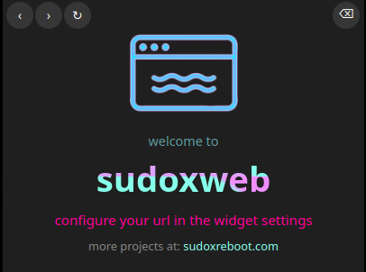
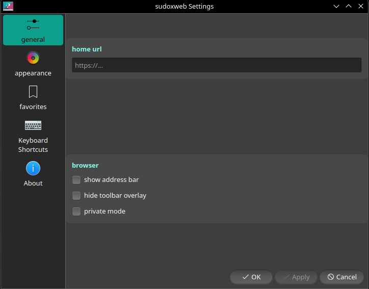
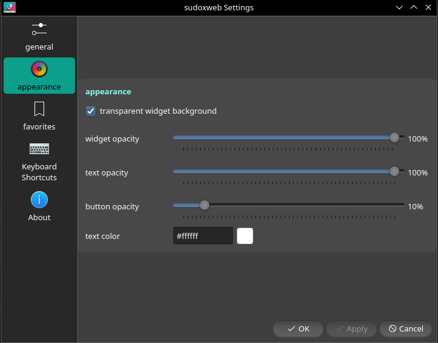
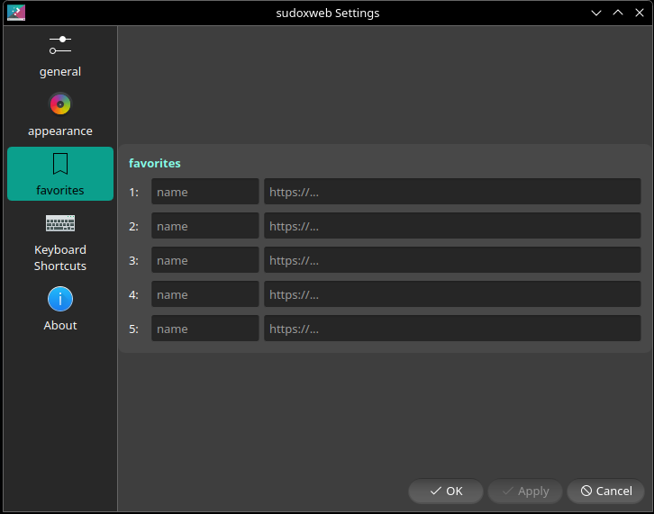

<table word-break="normal">
  <tr>
    <td width="250" height="150" align="center" valign="middle">
      
    </td>
    <td width="250" height="150" align="center" valign="middle">
      
    </td>
    <td width="250" height="150" align="center" valign="middle">
      
    </td>
    <td width="250" height="150" align="center" valign="middle">
      
    </td>
  </tr>
</table>


# sudoxweb

a plasma 6 web viewer widget built by [sudoxreboot](https://sudoxreboot.com).

embed any webpage directly on your plasma 6 desktop — dashboards, cameras, local services, anything with a url.

## features
- persistent sessions and cookies
- configurable url
- up to 5 favorites with custom names
- optional address bar with back, forward, home buttons
- transparent background
- widget, button, and text opacity sliders
- text color picker
- private mode
- hideable toolbar
- clear cache

## requirements
- kde plasma 6
- `plasma5support` (usually pre-installed)

## install
```bash
git clone https://github.com/sudoxreboot/sudoxweb
cd sudoxweb
bash install.sh
```

restart plasmashell:
```bash
kquitapp6 plasmashell && plasmashell > /dev/null 2>&1 &
```

right-click your desktop → **add widgets** → search **sudox**

## uninstall
```bash
cd sudoxweb
bash uninstall.sh
kquitapp6 plasmashell && plasmashell > /dev/null 2>&1 &
```

---

[sudoxreboot.com](https://sudoxreboot.com)
